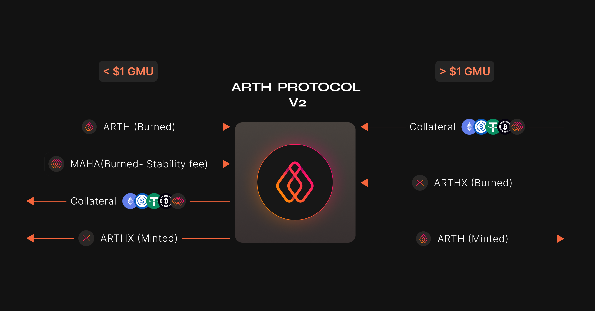

# What is ARTHX?

ARTH Shares \(ARTHX\) is the solution in bringing stability to ARTH but also keeping ARTH partially collateralised. ARTHX is a non-stable token that is designed to absorb the volatility of ARTH.

When ARTH is trading above 1$, arbitrageurs will mint ARTH by providing collatearl and sell ARTHX in the open market to realize a profit. Hence bringing the price of ARTH down to the 1$ mark.

When ARTH is trading below 1$, arbitrageurs will redeem ARTH along with ARTHX from the open market to get back the underlying collateral to realize a profit. Hence reducing the supply of ARTH to meet the actual demand for it.

However, there are many things that make ARTHX an attractive token. ARTHX is a deflationary token.

## Advantages of holding ARTHX

ARTHX has the chance of appreciating and being bought back by the protocol in a bull market. In a bull market, the value of the collateral exceeds the collateralisation ratio of ARTH, and so the protocol ends up with excess collateral which it needs to sell in the market. To do so, the protocol performs a "buy back and burn" with ARTHX using some of the excess collateral. This creates an upward price pressure on ARTHX.

Further ARTHX holders earn different kinds of [platform fees](../arth-201/how-does-arth-mitigate-against-stability-risk.md) that get charged when users interact with the protocol. These fees get distributed to ARTHX stakers who stake their tokens in the various pools available. ARTHX holders earn fees in collateral tokens and in MAHA/ARTH.

## Risks of ARTHX

While there are many potential benefits in holding ARTHX, there are also risks that come along with the benefits. The risks have been outlined below.

* ARTHX can witness sell pressure when the market turns into a bear market: When the market turns into a bear market and the net value of the underlying collateral decreases, then the protocol sells of collateral in return for a discount in ARTHX. This ARTHX is sold by arbitrageurs to keep ARTH stable and realize a profit. 
* ARTHX is a relatively new concept and can have undiscovered economic flaws: Being a new concept has its pros and cons. ARTHX comes in that same boat.
* ARTHX is a relatively new concept and can have undiscovered economic flaws.
* While ARTHX will be thoroughly audited and tested before launch, the protocol may enter unknown bugs/issues, either small or big.

