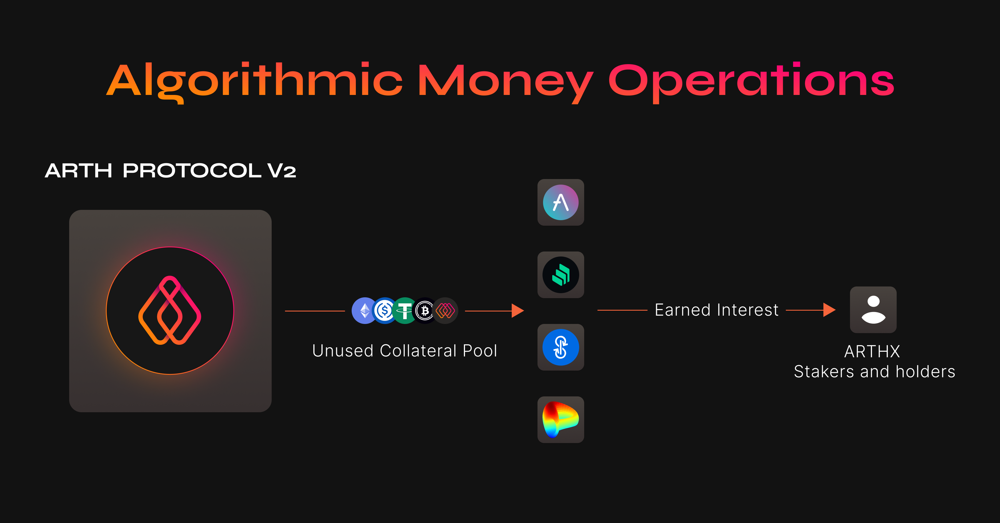

# Algorithmic Money Operations

Algorithmic Money Operations \(or AMOs\) are an investment strategy that utilizes the collateral that is locked up in the unused pools to earn interest that will be paid to all stakers and ARTHX holders.

## What is an AMO and how does it work?

An AMO can be thought of as a strategy that utilizes unused funds from the ARTH collateral pools and invests them into protocols like Compound Finance or AAVE to earn extra yield.

_AMOs_[ _were first conceptually introduced in the Frax protocol._](https://docs.frax.finance/amo/overview)\_\_

## Where does an AMO get the funds to invest?

An AMO gets its funds from the ARTH [collateral pools.](collateral-pools/) The collateral pools contain collateral that is deposited by users which is used to back ARTH. An AMO is given special permission to a collateral pool to borrow funds from it. 

Hence funds for an AMO to invest are borrowed from the ARTH collateral pools.

## How are the returns given back?

The returns are given back to ARTHX holders through the ARTHX staking pool. 

