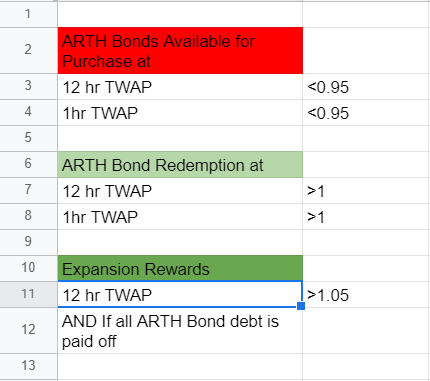

# Epochs & TWAP

### What is an Epoch?

Epoch refers to a unit of time interval that the ARTH protocol uses to decide when to make changes. In the ARTH protocol, the starting epoch is set to 12 hours.

A short epoch allows the protocol to adapt to changes in the system more quickly, however, it does cause the system to risk moving too fast. A long epoch allows the protocol's changes to be less drastic changes, however, it risks making the protocol slow to catch up with the market.

Hence it is very important to find epoch times that are not too long or too short. In the ARTH protocol, epochs are dynamic and can change based on the vote by governance token holders.

### What are Dynamic Epochs?

Dynamic Epochs imply that the protocol can change the time frame at which it looks at things without much impact on other components of the protocol.

Dynamic Epochs allow flexibility and can allow the governance protocol to understand and evaluate the protocol properly.

### Epoch Rewards for Advancing the Protocol

The ARTH protocol currently rewards 200 ARTH for those who advance the protocol's Epoch. This is done as a measure to keep the system decentralized and allow the general public to forward the protocol to the next epoch.

## What is TWAP? 

While spot price means the current market price of an asset, TWAP means a time weighted average price over a given period of time.   
  
Thus, the 1 hr TWAP takes an average price over a period of 1 hour & the 12 hr TWAP taken an average price over a period of 12 hrs. 

In the ARTH Protocol, the 1hr TWAP of ARTH is updated every hour, but the 12hr TWAP of ARTH is updated every 12 hrs, that is at every epoch.  

## TWAP Triggers 

Here are the different triggers that occur depending on the 12hr TWAP & the 1hr TWAP 

  
  

