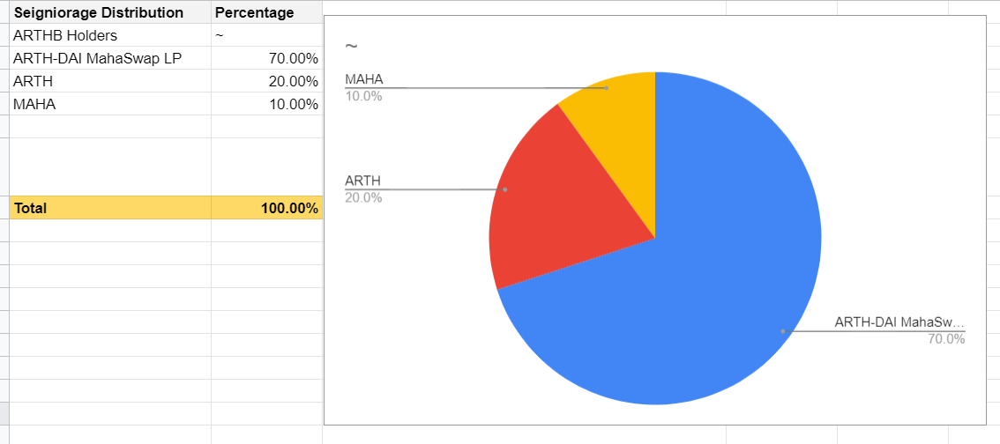

# Seigniorage Distribution

When the 12hr TWAP price of ARTH is **above** $1.05, new ARTH coins are minted as seigniorage and are added back into the circulation as a way of decreasing the coin’s price.

The distribution of these newly minted coins is a crucial factor in ensuring that coins are distributed without causing too much volatility in the price whilst at the same time focusing on the longevity of the token.

**The minting of ARTH happens in three phases:**

* First, 2% of minted ARTH is deposited into the ecosystem fund that’ll be used purely for ecosystem development. \(Exchange listings, Community Growth etc..\)
* Second, the remaining 90% of the newly minted ARTH will be allocated to pay back bond token redeemers \(ARTHB\).
* Any remainder that is left out is given to token holders who have bonded/staked in the following distribution pools.

## 1. MahaSwap ARTH-DAI LP Bonding 

Liquidity is one of the most important aspects of any stablecoin, hence the protocol gives more priority to those who provide liquidity to the ARTH-DAI pair on MahaSwap &/or any other AMMs in the future.

ARTH-DAI MahaSwap LP stakers will receive 70% of all the allocated seigniorage. The highest of all the pools.

**Rewards Vesting period: 8 hrs**

## 2. $ARTH Bonding 

To encourage ARTH holders to become passive stakers, the protocol has decided to allocate 20% of all allocated seigniorage to ARTH stakers.

Bonded ARTH tokens are unlocked after 5 days of vesting.

**Rewards Vesting period: 8 hrs**

## 3. $MAHA Bonding 

To encourage MAHA holders to become passive stakers, the protocol has decided to allocate 10% of all allocated seigniorage to ARTH stakers.

Bonded MAHA tokens are unlocked after 5 days of vesting.

**Rewards Vesting period: 8 hrs**

There is however another category of tokens that’ll receive seigniorage called “Community tokens”. These will be tokens \(decided by the MAHA Governance\) that’ll constantly receive 2% of all newly minted seigniorage. The community tokens are meant to attract token holders from various communities \(like YFI, Comp, Aave, etc..\) to the ARTH ecosystem.

## Can these parameters change? 

MahaDAO believes that these parameters can \(and should\) be changed in due time to find the right values that’d encourage more stability for the protocol.

This includes things like selecting which tokens will go into the community pools or what percentage of the allocation should change or for how long these tokens need to be bonded, etc...

