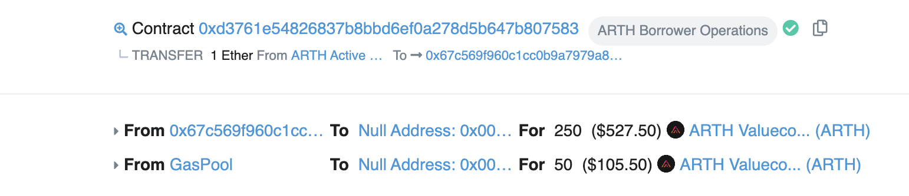

# Protocol Controlled Value \(PCV\)

Following the launch of Uniswap V3, the ARTH protocol will provide a liquidity pool that provides liquidity following a curve that concentrates the majority of the liquidity around a price range. 

By following a curve such as the one shown below, the protocol is able to provide the least slippage to trades that happen near the peg and also make it easier for the price to come back to the peg if it deviates too far away. 

\(The concept of having liquidity concentrated at a particular price range is similar to how Curve - CRV pools work\)

Users that deposit funds into the PCV, earn staking rewards in the form of ARTHX or MAHA.

## Why Protocol controlled value \(PCV\)?

PCV allows for more efficient markets and a quicker re-entry back to the peg if the price of ARTH deviates far away from the peg. 

\(Experimental: Modifying the curve also can be used to provide liquidity that incentivizes the buy-side more than the sell-side\)

