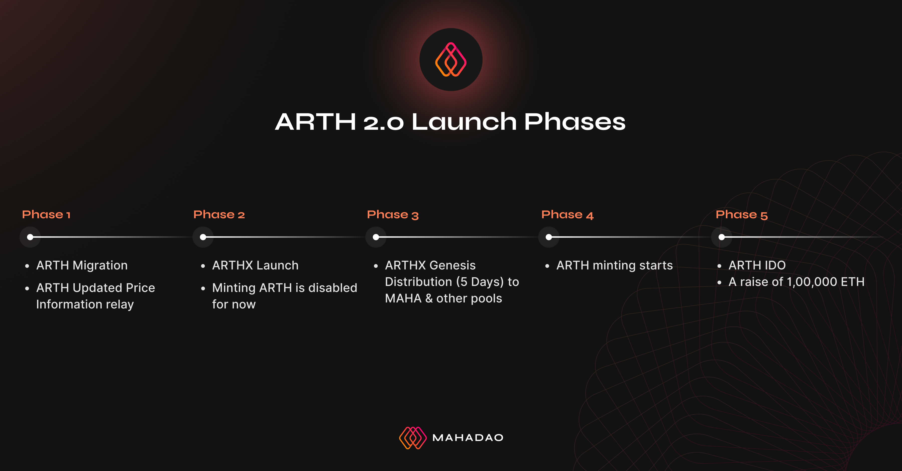

# ARTH 2.0 Launch Plan

ARTH 2.0 is going to be the next major protocol update that’ll bring stability and volume to ARTH.

### Phase 1 - Initial Distribution of ARTH v2 & Migration from v1

Migration will take place; All ARTH v1 holders get airdropped ARTH v2 tokens

Exchanges will be informed, Coingecko, CoinMarketCap, Etherscan, 1nch will be informed and the ARTH GMU price will be updated. 

### Phase 2 - ARTHX Launch & Recollateralization of ARTH

ARTHX is launched and users are able to redeem their ARTH for ARTHX.

Minting of ARTH is disabled and users redeem their ARTH for ARTHX at a 1:1 ratio. The amount of ARTHX minted is decided on the market price of ARTHX taken from Uniswap. This is how ARTHX tokens enter into the supply. 

Recollateralizing of ARTH happens at a 100% collateralization ratio and users who do so will be rewarded 101% of their collateral in ARTHX tokens along with a reward in MAHA tokens. ARTHX that gets minted during this phase will happen at a fixed price with respect to the collateral being issued.

Exclusive MAHA Staking programs start for the following pools:

* ARTHX
* ARTHX/ETH SushiSwap LP

These staking pools will close deposits once Phase 2 has completed.

**Users who redeem their ARTH for ARTHX reduce the supply of ARTH, hence further help the protocol reach its collateralization goal.**

Phase 2 ends once the protocol is at least 90% backed by collateral. If the protocol does not reach this target, then the MAHA community can decide if Phase 2 should be extended or if ARTH should be [rebased](arth-201/rebase-mechanism.md) to meet the current value of the collateral and meet the circulating supply of ARTH.

### Phase 3 - ARTHX is distributed for MAHA holders

In phase 3, the ARTHX supply is inflated by 5% and is distributed to MAHA token holders and to the various new staking programs that'll come in for ARTH.

### Phase 4 - ARTH minting is enabled & staking programs for ARTH go live

After enough users have had their hands on ARTH and on ARTHX, ARTH minting is enabled and people can effectively start using ARTH for either performing arbitrage across the various ARTH pools or by taking on leveraged positions in any one of ARTH's underlying collaterals.

Rewards go live for all ARTH LP pools. This includes rewards for the following pools:

* ARTH-WETH SushiSwap LP
* ARTH-WBTC SushiSwap LP
* ARTH-USDC SushiSwap LP
* ARTH-MAHA SushiSwap LP \(Will be introduced at a later stage\)

Staking pools won't have any timelock allowing for LPs.

By introducing staking pools, the protocols start building up liquidity for ARTH making ARTH more liquid and further cement its role as a 'lending' and 'arbitrage' token.

\(Liquidity pool for Uniswap V3 will be launched after the [PCV](arth-201/protocol-controlled-liquidity.md) goes live\)

### Phase 5 

After ARTH has successfully maintained stability for 7 days. The team will launch Phase 5, the details of which will be made public closer to the Phase 5 launch.

