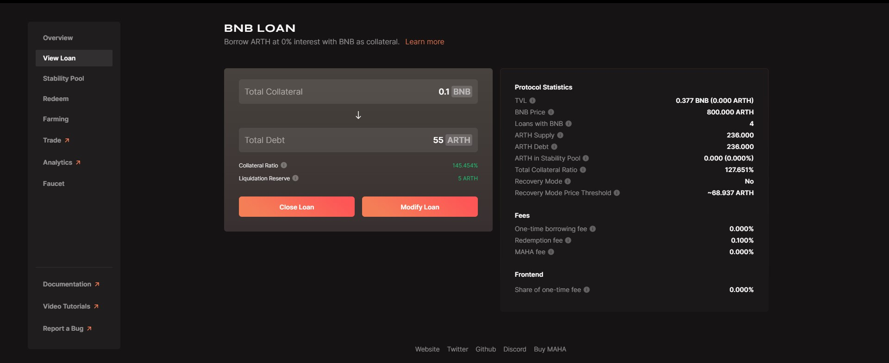

# How to farm?

### DEPOSIT

Once you have procured either ARTH or MAHA tokens, you can begin to farm on either Polygon or BSC.

Step 1: Go to [https://app.arthcoin.com/](https://app.arthcoin.com) and select your preferred network from the top right.

.jpg>)

Step 2: Once you select the network; you need to navigate to the farming section.&#x20;

Step 3: In your desired network, select the pools you would like to farm. You can select any of the following pools.\
&#x20;**Pools on Binance Smart Chain:**\
🔹 $ARTH / $MAHA\
🔹 $ARTH / $BUSD

**Pools on Polygon:**\
🔹 $ARTH / $MAHA\
🔹 $ARTH / $USDC

Step 4: Click on add liquidity. This will direct you to the respective pool on the DEX based on your network preference.

Step 5: After adding liquidity for the selected pool on the DEX, return to the farming tab and click on deposit.&#x20;

Step 6: Once you navigate back to the farming tab; you need to click on deposit.

Step 7: Once you click on the deposit button; you will get a pop up regarding the amount you want to deposit in the pool. The user needs to input an amount and confirm the deposit.&#x20;

Step 8: Once you confirm the amount; the user will get a final confirmation regarding the deposit made.

### WITHDRAW:

Step 1: A user will get a withdraw option for a specific pool only if the user has deposited an amount in that pool. The user needs to navigate to a pool that they have deposited in and accordingly click on the withdraw button.&#x20;

.jpg>)

Step 2: Once the user clicks on the withdraw button; the user is prompted to input an amount that they would like to withdraw.

Step 3: Once the user inputs an amount to be withdrawn they need to wait for the final confirmation of the withdrawal being made.&#x20;

### CLAIM:

Step 1: A user will get the claim option for a specific pool only if the user has deposited an amount in that pool. The user needs to navigate to a pool that they have deposited in and accordingly click on the claim button.&#x20;

Step 2: Once the user clicks on the claim button; the user is prompted to input an amount that they would like to claim.

Step 3: Once the user inputs an amount to be claimed they need to wait for the final confirmation of the claim being made.&#x20;

## Tutorial video for users to help understand the concept of farming:


Farming step by step tutorial for users.&#x20;

