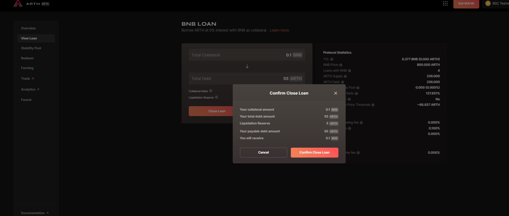

# Closing a Loan

**Step 1:** Go to the 'View Loans' section.&#x20;

**Step 2:** Here you will see two options, `Close Loan` and `Modify Loan`. Click on C**lose Loan**.

**Step 3:** You will be prompted to confirm the closure of the same. Review all the details and make sure you have enough `ARTH` balance needed to close the loan.

**Step 4:** You will get a metamask wallet confirmation for the closure after which the loan will be closed. Confirm it and your loan will now be closed.
