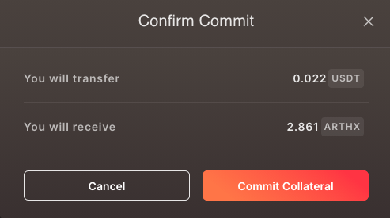
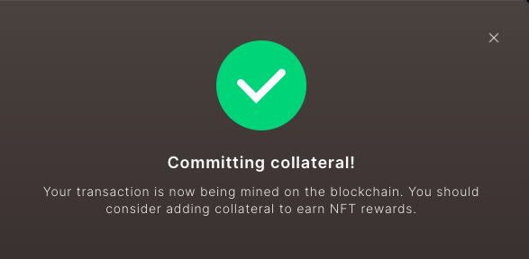

# Commit Collateral to get ARTHX

Step 1: Go to [https://arthcoin.com/\#/genesis](https://arthcoin.com/#/genesis)

Step 2: Select the collateral you would like to commit. Currently, you can choose from USDC, WETH, WMATIC, WBTC, USDT \(soon\) 

Step 3: Enter the amount you'd like to commit

Step 4: Click on Approve USDT or collateral name 

Step 5: This will open a wallet dialogbox. Confirm the transaction on your wallet to proceed.  

Step 6: Click on Commit collateral

Step 7: Confirm the ARTHX you will receive for the committed collateral  

Step 8: Click on Commit Collateral 

This screen shows you have successfully committed your collateral in the ARTH 2.0 Genesis. 

