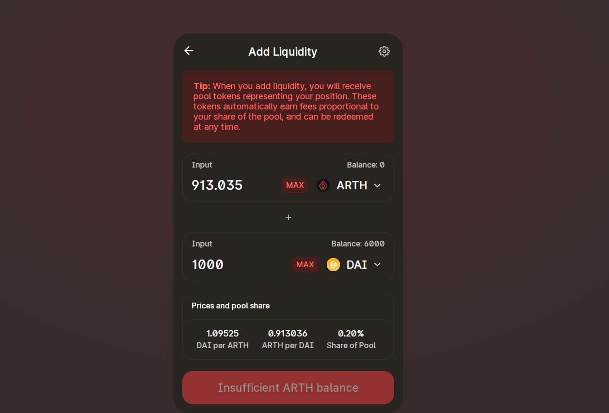

# Create an ARTH/DAI Liquidity Pool on MahaSwap

Once you hold ARTH and DAI in your metamask, you can stake liquidity via Uniswap.

Use this link to add liquidity onto Uniswap and earn LP tokens:



On MahaSwap, you need to provide both sides of the liquidity in order to generate the LP tokens. In this case, simply enter the amount of ARTH you wish to add, and MahaSwap will automatically fill out the DAI side. Click **Supply** to confirm the transaction:

You now hold some ARTH\_DAI-UNI-LPv2 tokens in your wallet  

  

