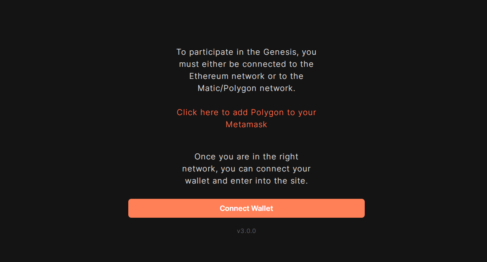
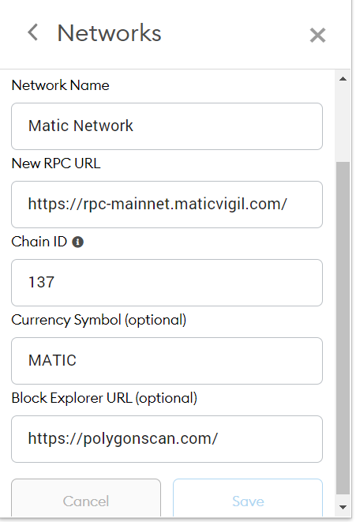

# Getting started

## Connecting your wallet 

Step 1: Visit [arthcoin.com](https://arthcoin.com?utm_source=gitbooks&medium=organic)

Step 2: Click on Connect wallet 

Step3: After connecting onto your wallet, you might want to add Polygon to your wallet \(Metamask\). You can do this by clicking on CLICK HERE TO ADD POLYGON TO YOUR METAMASK or by adding the following details on your wallet &lt; Custom RPC 

You are now ready to interact with the ARTH valuecoin. 

