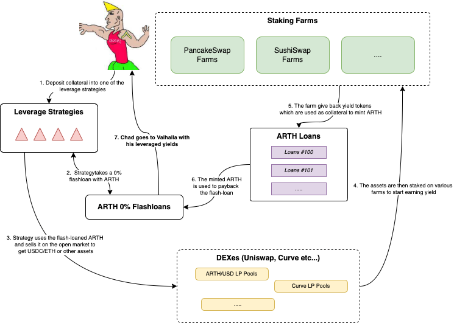

# Leverage Strategies

### What is leverage trading?

Leverage means using borrowed capital to carry out trades. Leverage trading can help in amplifying your buying or selling power, it also allows you to trade larger amounts. Even if your initial capital is small, a user can use it as collateral to make leveraged trades. While leveraged trading can help a user multiply their potential profits, they are highly likely to be subjected to high risk - especially in the volatile crypto market. Therefore it is advisable to be careful when using leverage to trade crypto. It may lead to substantial losses depending on the volatility of the crypto market.

### How does leveraged trading work? 

Before a user borrows funds and starts trading with leverage, they need to deposit funds into their trading account. The initial capital that is provided is what is called collateral. This collateral required depends on the leverage that a user wants and the total value of the position that they want to open which is also known as a margin.

