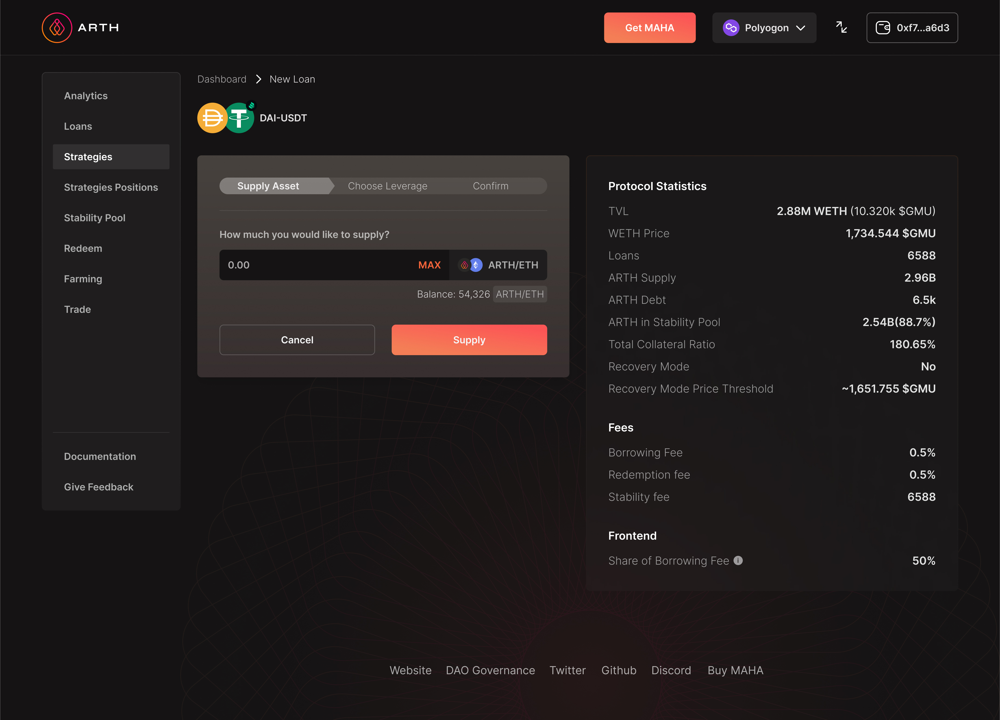
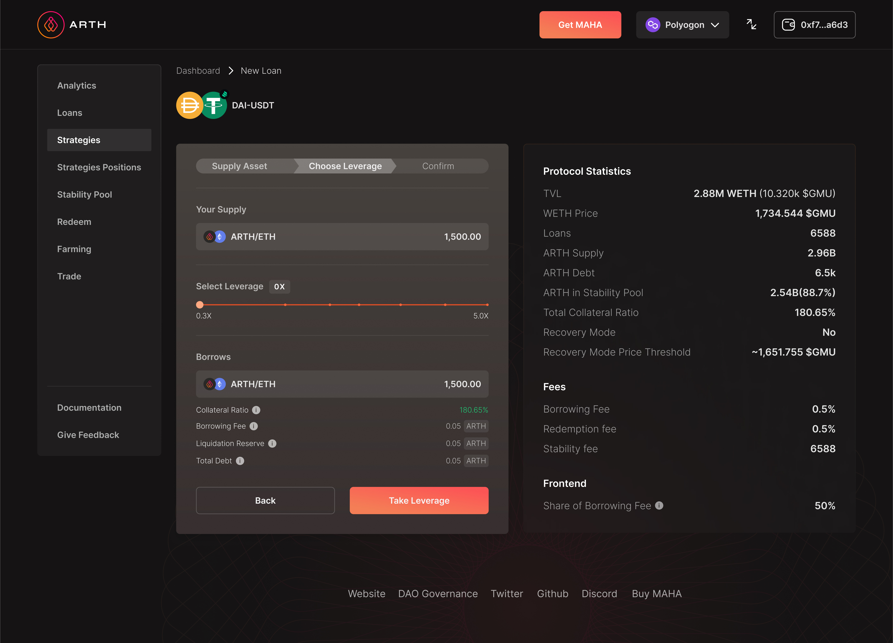
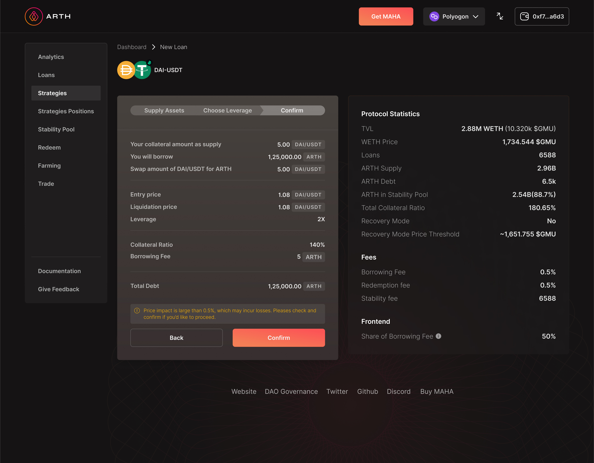

# How to use leverage?

Leverage strategies allow you to gain more exposure to assets/farms/LPs using ARTH's minting mechanism.&#x20;

Step 1: Go to [https://app.arthcoin.com/](https://app.arthcoin.com) and select your preferred network from the top right.

Step 2: Once you select the network; you need to navigate to the leverage section.&#x20;

.jpg>)

Step 3: In your desired network, select the pools you would like to add liquidity into. You can select from any of the pools displayed on the page along with other details such as the maximum leverage allowed in the pool, the reward fee and the one time fee.&#x20;

For an existing user; It also displays the details of the other leverage positions that a user has opened till date.&#x20;

Step 4: For a first time user; when they visit the page; they need to select a pool. Once they select the pool they need to click on the open position option besides the pool to register their leverage account. \
NOTE: This comes up only for a first time user.&#x20;

Step 5: To get a registered leverage account; the user needs to agree to all the terms and conditions and connect their wallet and click on confirm.&#x20;

Step 6: Once the user gets a confirmation regarding the registration they can click on the 'open position' button again to proceed.&#x20;

Step 7: After following through with step 6; the user will be directed to the supply asset page. Here the user needs to input an amount that they are willing to supply.&#x20;

Step 8: Once they have input an amount the user needs to click on 'supply' to proceed forward.&#x20;

Step 9: After following through with the above the user is directed to the next page where the user needs to select the leverage that they are willing to opt for. \
NOTE: The leverage ranges from 0.3x- 10x.&#x20;

Step 10: Once the user selects the leverage value they will see the final borrow amount along with the other details such as the collateral ratio, borrowing fee etc. Once the user has reviewed all the details they need to click on 'take leverage' .&#x20;

Step 11: After this the user will be directed to the final confirmation page where all the details will be displayed for a final review from the user's end.&#x20;

Step 12: Once a user clicks on 'confirm' this will confirm the user's leverage position.&#x20;

### ADD LIQUIDITY

Step 1: Suppose a user wants to add more liquidity, the user needs to select the pool that they have already opened a position with and click on the 'add liquidity' button.&#x20;

Step 2: After this the user will be redirected to the supply page where in the user will have to input an amount that they want to supply and select the leverage they wish to opt for and confirm the transaction.&#x20;

### CLOSE AND CLAIM:&#x20;

Step 1: Suppose a user wants to 'close and claim reward' the user needs to select the pool that they have already opened a position in and click on the 'close and claim reward' button.&#x20;

Step 2: Once they follow through with the above steps; the user will be provided with details of the reward and the position while closing it. Once the user views the details, the user needs to click on confirm and close the position and claim the reward.&#x20;
