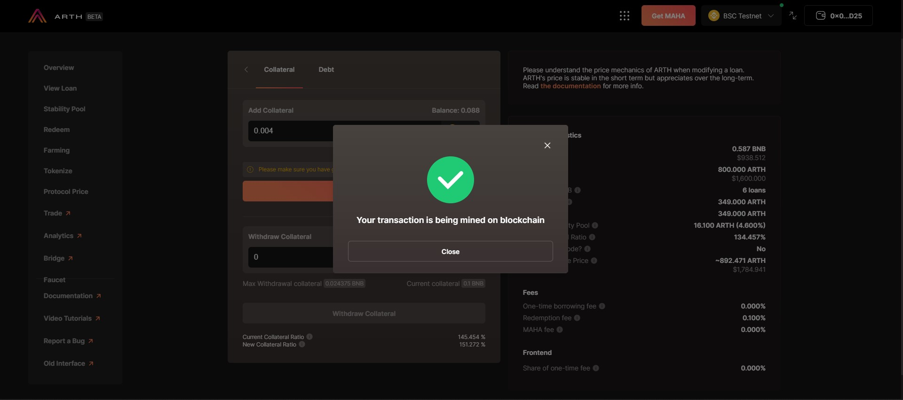
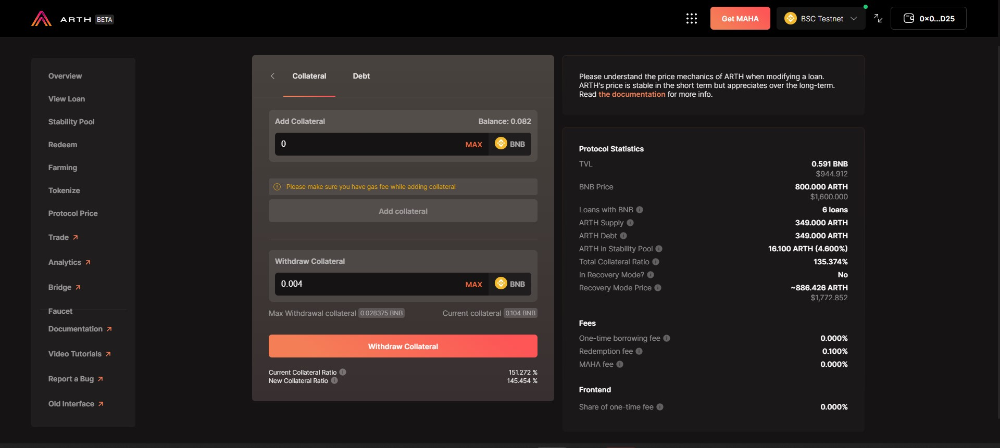

# Modifying a Loan

Modify loan means you can add more collateral or you withdraw collateral. This lets you modify your existing loans. You can make these changes by clicking on any of the loans in the ' Your loans' section.

**Step 1:** Go to 'View loans' section and click on any of the opened loans.

**Step 2:** Here you will see two options, "Close Loan" and "Modify Loan". Click on **Modify Loan**.

**Step 3:** Suppose you want to add more collateral and you can input an amount in the add collateral section and click on **Add collateral**.

**Step 4:** Suppose you wanted to add more collateral, and you follow through with step 3 you will get a confirm add collateral pop-up followed by a metamask wallet confirmation.

**Step 5:** Suppose you want to add more collateral and you can input an amount in the add collateral section and click on **Add collateral**.

**Step 6:** After you click on **Withdraw collateral** you will get a confirm withdraw collateral pop up; which is followed by a metamask wallet confirmation.

_**NOTE**: Always check the status of all your transactions after clicking on the refresh button to ensure changes are reflected successfully._

