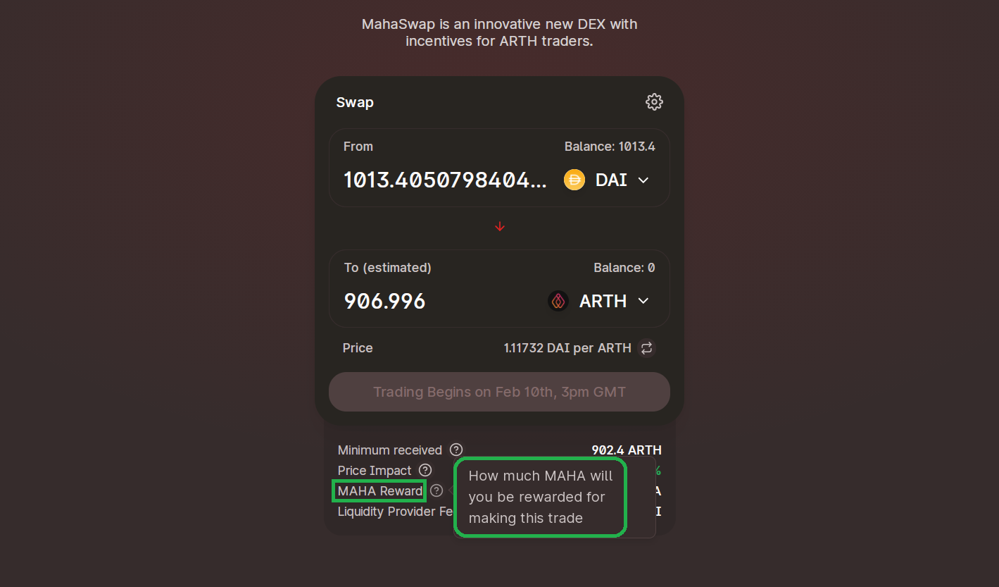

# Purchase ARTH & MAHA

**ARTH**:

Step 1 - Ensure you have ETH ready in your wallet to pay for gas fees

Step 2 - Purchase ARTH from MahaSwap via the following Liquidity Pools:

**MAHA:**

Step 1 - Ensure you have ETH ready in your wallet to pay for gas fees

Step 2 - Purchase **MAHA** from Uniswap via the following Liquidity Pools:



## 

