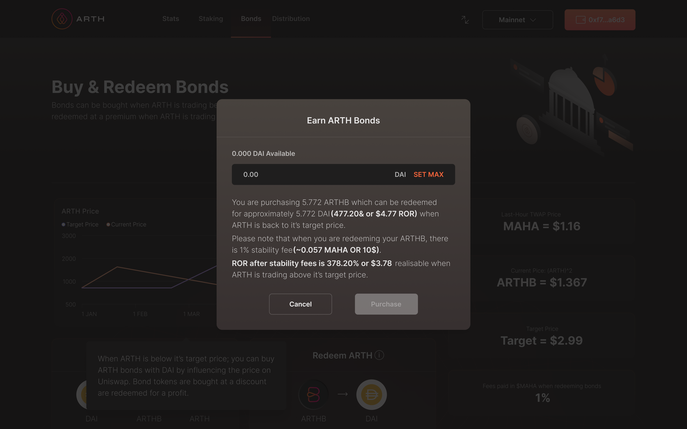

# Purchasing ARTH Bonds\(ARTHB\)

**Please Note: You can only buy ARTH Bonds when the 12hr & 1hr TWAP price of ARTH is below $0.95**

Bond tokens are only issued if ARTH is trading below its current price. ARTHB does this to decrease the supply buy buying back and therefore raising the price of ARTH.

As with any new token used on the platform, we have to first approve DAI, which will be used to purchase ARTHB at a discount, you can do this by clicking on the Approve DAI button in the **Bonds section** of the Arthcoin website, as shown below:

You will also have to repeat this step by clicking on Approve ARTH in order to use ARTHB on the platform.

Purchasing ARTHB will use MahaSwap to exchange your DAI for ARTH, which is then sent back to users in the form of bonds.

Once you have approved both DAI & ARTHB tokens for use on the platform, click on the **Purchase** button as shown below and follow the instructions provided by the Metamask wallet, this will convert DAI to ARTHB:

\*\*\*\*

