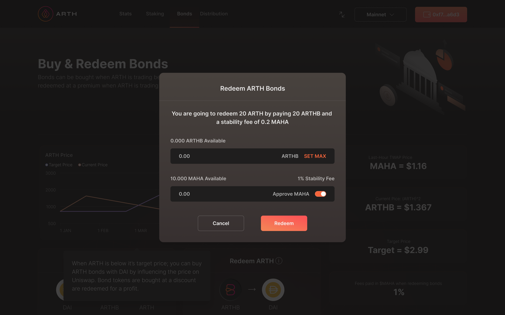

# Redeeming ARTH Bonds\(ARTHB\)

**Please Note: You can only redeem ARTH Bonds when the 12hr & 1hr TWAP price of ARTH is above $1**  
  
Once the target price is reached, you can redeem the ARTH Bonds for a profit at a 1:1 rate with ARTH. You can also further exchange your ARTH to redeem DAI in just one-click.

When redeeming  ARTH bonds into DAI, a stability fee is payable in MAHA.

Go to the Redeem bond page and click on the button to Redeem bond tokens: 

_Please note: That the stability fees in MAHA for ARTH Bond redemption is currently paused as per a community vote until further notice._

