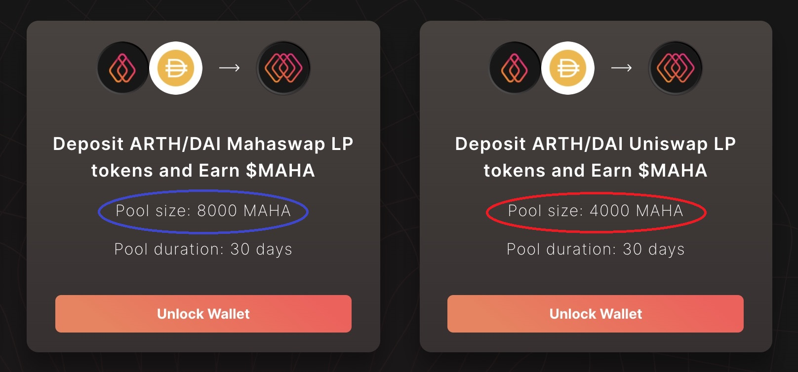

# Staking Tokens to earn $ARTHX & $MAHA

You can earn staking rewards buy staking your ARTH/MAHA tokens by following the below steps: 

### For Non-LP pools: 

* Visit [https://arthcoin.com/\#/staking](https://arthcoin.com/#/staking)
* Click on ‘Connect’ on the top right to connect to your wallet
* Select the respective wallet you want to connect to & Confirm the connection request in your wallet
* Once your wallet is connected, select the Pool you want to participate in.
* Click on SELECT in the respective pool you want to participate in
* Click on APPROVE “token\_name”
* Click on Confirm when prompted with the Transaction fee prompt on your wallet
* Click on Deposit “token\_name” & enter the number of tokens you want to deposit. Click on Confirm
* Click on Confirm if prompted by Wallet
* Wait for a few seconds, & your ARTH & token balance shall show up. You can then Settle & Withdraw both your tokens.

### For LP Pools 

You can follow the below steps to stake your LP tokens, considering that you have already added Liquidity to either the MahaSwap pool or the Uniswap pool. Note that the rewards are more for the MahaSwap pool. 

* Please select the correct LP you want to participate in
* Click Approve to approve your LP tokens on the wallet
* Now you can click on deposit
* Select the amount of LP tokens you would like to stake/deposit 
* Click on Confirm 
* Confirm the transactions on your wallet to finish the transaction 

## Staking pools available

* Deposit MAHA/ETH Uniswap LP tokens and Earn $MAHA - 30 days 
* Deposit ARTH/DAI Mahaswap LP tokens and Earn $MAHA - 30 days 
* Deposit ARTH/DAI Uniswap LP tokens and Earn $MAHA - 30 days 
* Deposit $ARTH and Earn $MAHA - 30 days 

  
Please note: Staking pools can be added/removed. Please always verify the current available pools on [https://arthcoin.com/\#/staking](https://arthcoin.com/#/staking) 

