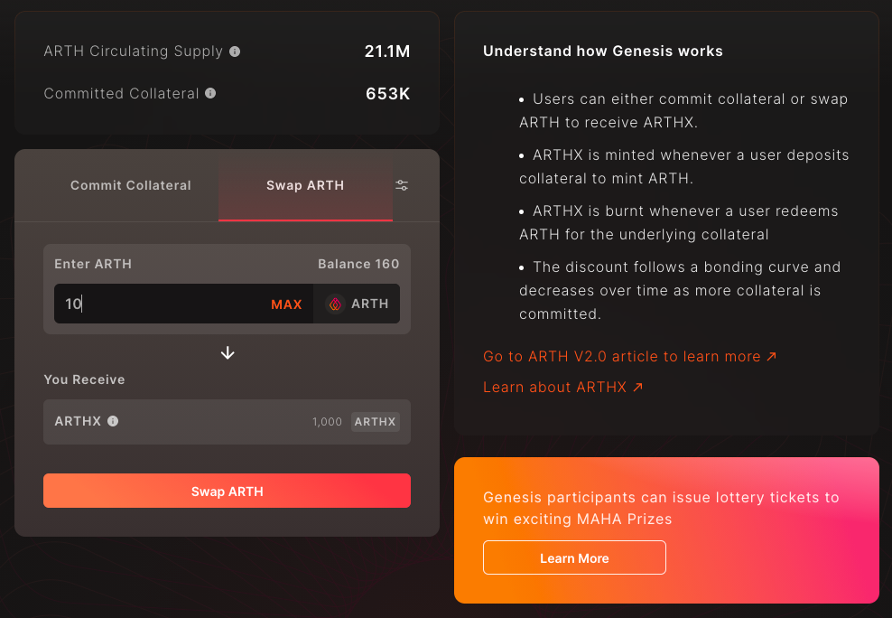

# Swap ARTH for ARTHX

Step 1: Go to [https://arthcoin.com/\#/genesis](https://arthcoin.com/#/genesis)

Step 2: Go to the Swap ARTH tab 

Step 3: Enter the amount of ARTH you would like to swap for ARTHX 

Step 4: Click on Approve ARTH 

Step 5: This will open a wallet dialogbox. Confirm the transaction on your wallet to proceed.  

Step 6: Click Confirm on your wallet to proceed

Step 7: Click on Swap ARTH 

Step 8: Confirm the amount of ARTHX you will receive for swapping ARTH. _Note: 1 ARTH = 100 ARTHX_

Step 9: Click on Swap ARTH again 

Step 10: This will open a dialogbox on your wallet. Click on Confirm button 

This screen confirms that you have successfully swapped your ARTH tokens for ARTHX. Congratulations! 

