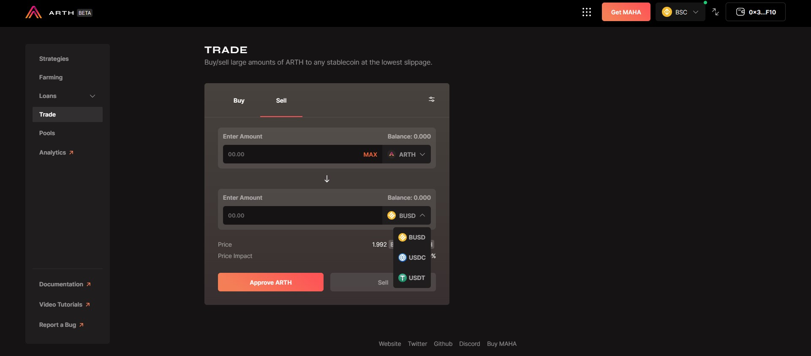
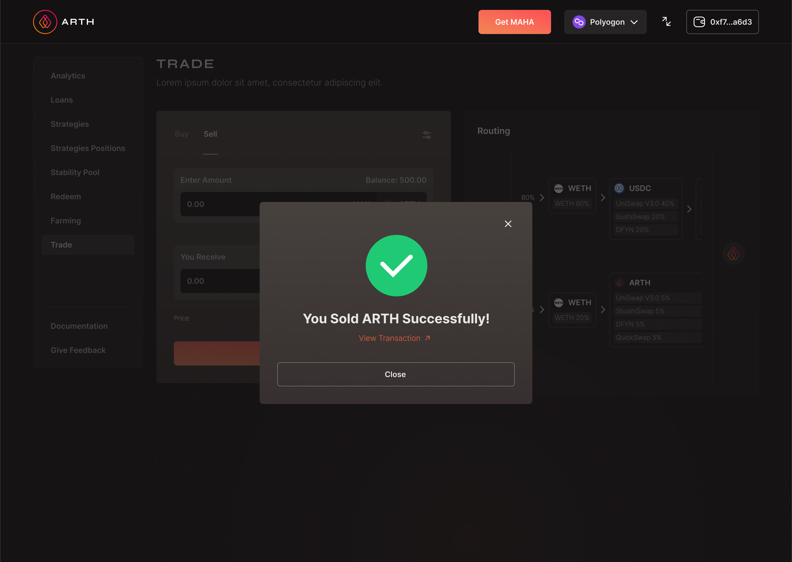

# Trade

## BUY:&#x20;

Step 1: Go to [https://arth.mahadao.com/](https://arth.mahadao.com) and select your preferred network from the top right.

Step 2: Once you select the network; you need to navigate to the trade section. \
NOTE: Under the polygon network the currency available are DAI,USDC,USDT.

Step 3: There are two options on the trade page: BUY and SELL.

Step 4: Suppose you want to buy ARTH; click on the Buy section.&#x20;

Step 5: After the user navigates to the buy section, select the currency you want to trade in for ARTH from the drop-down.&#x20;

Step 6: After selecting the currency from the drop-down, the user needs to input an amount that they want to trade in for ARTH. As soon as the user inputs an amount, it shows the user the amount of ARTH the user will receive for the entered collateral.

Step 7: Once the user inputs an amount, the user needs to click on the approve button first to approve the collateral.&#x20;

Step 8: Once the user follows through with the approval and receives a confirmation of the transaction, the user needs to click on buy to close the transaction.&#x20;

Step 9: Once the user clicks on buy and gets a successful transaction message it means that the user has completed the process.&#x20;

.jpg>)

## SELL:

Step 1: Go to [https://arth.mahadao.com/](https://arth.mahadao.com) and select your preferred network from the top right.

Step 2: Once you select the network; you need to navigate to the trade section. \
NOTE: Under the polygon network the currency available are DAI-USDC-USDT

Step 3: There are two options on the trade page: BUY and SELL.

Step 4: Suppose a user wants to sell ARTH; the the user needs to click on the sell section on the trade page.&#x20;

Step 5:  After the user navigates to the sell section and needs to select the currency they want to trade  ARTH for from the drop down.&#x20;

Step 6: After selecting the currency from the drop down the user needs to input an amount that they want to trade ARTH in for . As soon as the user inputs an amount it shows the user the amount that the user will receive for the amount of ARTH that they are trading in for the selected currency. \
NOTE: If a user selects any specific currency immediately the amount for 1 ARTH as compared to the selected currency value is displayed below. &#x20;

Step 7: Once the user inputs an amount then the user needs to click on the approve button first to approve the trade.&#x20;

Step 8: Once the user follows through with the approval and receives a confirmation of the transaction the user needs to click on the sell button to close the transaction.&#x20;

Step 9: Once the user clicks on sell and gets a successful transaction message it means that the user has completed the process.&#x20;

