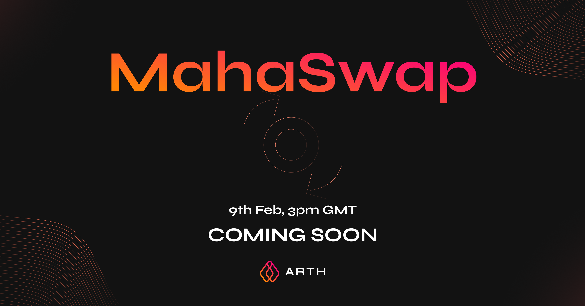

# Welcome to MahaSwap

## **What is MahaSwap?** 

MahaSwap is a replica of Uniswap & its migration contracts are a fork of Sushiswap so they offer a safe, audit-proofed and trusted environment.

The **MahaSwap platform** enables $ARTH to move in the direction it should, thereby maintaining its price peg but also rewarding users who take positive actions by rewarding $MAHA & $ARTH through various ways, such as Staking your LP tokens to earn $MAHA, bonding your LP tokens to earn $ARTH Seigniorage\(scheduled for later during the expansion phase\), and more.

🚀**MahaSwap launched on Feb 9th, 3pm GMT.** 

### ℹ️Important Timelines 

* Launch of MahaSwap: **Tuesday, February 9, 3pm GMT**
* Migration of LP tokens to MahaSwap will start from **Tuesday, February 9, 3pm GMT**
* Staking MahaSwap LP tokens to earn $MAHA starts from **Tuesday, February 9, 4pm GMT**
* Trading starts from **Wednesday, February 10, 3 pm GMT**

To avoid any chance of an impermanent loss, there is a 24 hr gap between when migration starts & when trading starts. \(Trading will be paused during migration\).  

### Important Jumpstart Links

<table>
  <thead>
    <tr>
      <th style="text-align:left">
        

        
#

      </th>
      <th style="text-align:left">Time</th>
      <th style="text-align:left">Links</th>
    </tr>
  </thead>
  <tbody>
    <tr>
      <td style="text-align:left">MahaSwap link</td>
      <td style="text-align:left">Feb 9, 3 pm GMT</td>
      <td style="text-align:left"><a href="http://mahaswap.com/">http://mahaswap.com/</a>
      </td>
    </tr>
    <tr>
      <td style="text-align:left">Add/Migrate LP tokens</td>
      <td style="text-align:left">Feb 9, 3 pm GMT</td>
      <td style="text-align:left"><a href="https://migrate.mahaswap.com/">https://migrate.mahaswap.com/</a>
      </td>
    </tr>
    <tr>
      <td style="text-align:left">Stake your new ARTH_DAI MahaSwap LP tokens to earn $MAHA</td>
      <td style="text-align:left">Feb 9, 4 pm GMT</td>
      <td style="text-align:left">https://arthcoin.com/#/staking</td>
    </tr>
    <tr>
      <td style="text-align:left">BOND/Stake your new ARTH_DAI MahaSwap LP tokens to earn $ARTH seigniorage</td>
      <td
      style="text-align:left">In expansion mode</td>
        <td style="text-align:left"><a href="https://arthcoin.com/#/distribution">https://arthcoin.com/#/distribution</a>
        </td>
    </tr>
  </tbody>
</table>

### [📚](https://emojipedia.org/books/#:~:text=Color%20and%20orientation%20vary%20across,to%20Emoji%201.0%20in%202015.)Definitive Guides

* How to stake your LP tokens to earn $MAHA rewards: [Stake tokens to earn rewards in $MAHA](tutorials/stake-tokens-to-earn-rewards-in-usdmaha.md)
* How to BOND/stake your LP tokens to earn seigniorage: [https://docs.arthcoin.com/tutorials/seigniorage-distribution](https://docs.arthcoin.com/tutorials/seigniorage-distribution)

## How-to guide for users? 

**The single-click method:** 

* Go to [https://mahaswap.com/](http://mahaswap.com/)
* Connect your wallet
* Click on _Migrate UNI LP_
* Select your wallet type
* Select the Uniswap Liquidity you would like to migrate
* Confirm the transactions on your wallet

**Add liquidity directly to MahaSwap:**

In case, you would like to add liquidity directly onto MahaSwap, you can do that too:

* Visit [https://mahaswap.com/](https://mahaswap.com/)
* Connect your wallet
* Go to the _Pool_ section from the top menu
* Select ARTH & DAI
* Select the amount of tokens you want to add as liquidity
* Approve ARTH & DAI
* Click on Supply & confirm your transactions in your wallet

By following the above steps, you would be able to provide liquidity easily. Now you can head on to [https://arthcoin.com/\#/staking](https://arthcoin.com/#/staking) & stake your LP tokens to earn Staking rewards in $MAHA. 

##  

